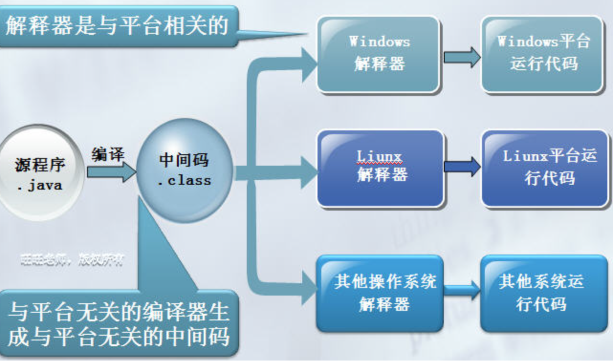
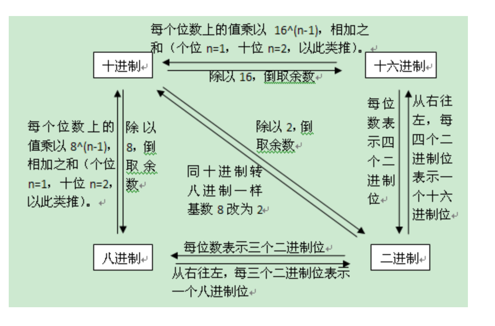

### JAVA入门

#### 任务

```java
1.常用DOS命令
2.JAVA发展简史
3.java体系
4.java机制
5.环境变量配置
6.注释
7.进制
```

#### 目标

```java
1.掌握常用DOS命令
2.掌握JAVA发展简史
3.掌握java体系
4.掌握java机制
5.掌握环境变量配置
6.掌握注释
7.掌握进制
```

#### 第一节：基础

#####1.1 常用的DOS命令	

```
cd　　　　　     改变当前目录
cd..			回到上级目录
c： d：e: ...    切换盘符
dir 			俩出当前目录下的文件以及文件夹
rd      		删除目录
del			     删除文件
exit 			退出dos命令行
mspaint   	      画图板
notepad          打开记事本
```
##### 1.2 JAVA发展简史


> ​	 Java是Sun（Stanford University Network）于1995年推出的一种高级编程语言
>
> ​	1998年 JDK1.2，更名为Java2
>
> ​	2000年 JDK1.3，JDK1.4
>
> ​	2004年 JDK1.5，更名为JDK 5.0
>
> ​	2005年 JDK6.0
>
> ​	2009年 Oracle（甲骨文）74亿美元收购Sun。取得java的版权。
>
> ​	2011年 java7.0 
>
> ​	2014年3月19日，java8.0

#####1.3 JAVA体系

#####1.3.1 JAVA的版本	

```
1. Java SE（Java Platform，Standard Edition）。Java SE 以前称为 J2SE。它允许开发和部署在桌面、服务器、
    嵌入式环境和实时环境中使用的 Java 应用程序。
2. Java EE（Java Platform，Enterprise Edition）。这个版本以前称为 J2EE。最新叫Jakarta EE。三者是一个东西。
	开发企业级的应用，2018年3月，开源组织Eclipse基金会宣布，Java EE（Enterprise Edition）被更名为Jakarta EE。
3. Java ME（Java Platform，Micro Edition）。这个版本以前称为 J2ME。Java ME 为在移动设备和嵌入式设备（比
    如手机、PDA、电视机顶盒和打印机）上运行的应用程序提供一个健壮且灵活的环境.
```
##### 1.3.2 JAVA 的应用场景

```
1. 开发桌面应用程序
银行软件、商场结算软件
2.开发面向Internet的web应用程序
中国移动等门户网站、阿里巴巴等电子商务网站
3.提供各行业的解决方案 
金融、电信、电力 医疗 商务...
4.开发android手机应用程序
大数据开发的基础
```

#####1.4  JAVA的特性

```
1. 一种面向对象的编程语言
2. 一种与平台无关的语言。(它提供了在不同平台下的解释运行环境)
3. 一种健壮的语言，吸收了C/C++语言的优点。
4. 具有较高的安全性。(自动回收垃圾，强制类型检查，取消指针)
```


   


   ```
垃圾回收器：
Garbage Collection垃圾回收：将不再使用的内存空间应当进行回收。
在C/C++等语言中，由程序员负责回收无用内存
Java语言消除了程序员回收无用内存空间的责任：
JVM提供了一种系统线程跟踪存储空间的分配情况。并在JVM的空闲时，检查并释放那些可以被释放的存储空间。
垃圾回收器在Java程序运行过程中自动启用，程序员无法精确控制和干预。
   ```

##### 1.5 运行机制

##### 1.5.1 计算机的高级编程语言类型：

> 编译型C ,C++,Pascal
>
> 解释型Basic

##### 1.5.2 Java 语言是两种类型的结合；

```
先编译,再解释执行
```

#####1.5.3 开发过程的三个步骤


#### 第二节：环境搭建

##### 2.1 安装jdk

[JDK安装步骤详情](JDK安装步骤详解.docx)

#####2.2 配置环境变量

[JDK的环境变量配置](jdk环境配置.txt)

#####2.3安装编译工具

```
第一天建议使用EditPlus 或者是  notepad++
```

####第三节：第一个HelloWorld

```java
类   类名
public class Demo 
{
	// 公开的公共  void 没有返回值   () 方法的标志
	public static void main(String[] args) 
	{		// 静态的  main方法的名字      String[] args 雪糕钱
		System.out.println("Hello World!");
		// 系统 向外输出  打印
	}
}
```

##### 3.2 源文件

```
源文件: 是一个后缀面是.java的文件，里面写的是java代码
```

##### 3.3 源文件中的类

```
1. 如果类不是public修饰的 ， 类名可以和源文件的名字不同，但是如果 类名是public修饰的，那源文件的名字必须和	类名相同
2. 一个源文件中可以有多个类
3. 一个源文件中至多只有一个用public修饰的类
```

#### 第四节：注释

##### 4.1 文档注释 

```java
 /**  
  	要求放在类上面， 标注本类的作用  作者  时间等信息
 */
```
#### 4.2 单行注释 

```java
//     适用于注释一行
```
##### 4.3 多行注释

```java
/*多行注释     适用于同时注释很多行*/
```
#### 第五节：进制

##### 5.1 普及二进制

```java
计算机中的数据都以二进制数字保存。
二进制：逢二进一。即只有0、1两个值。
如：十进制的10在计算机内保存为二进制的1010
计算机中信息的存储单位
位（bit）：表示一个二进制数码0或1，是计算机存储处理信息的最基本的单位。
```

##### 5.2 进制转换

```java
1. 二进制与十进制之间的转换
2. 二进制与八进制、十六进制之间的转换
3. 十进制与八进制、十六进制之间的转换
```



#### 第六节 ： 总结

#### 作业：

​	1.安装jdk配置好环境变量

​	2.默写hello world程序

#### 面试题

​	1.一个".java"源文件中是否可以包括多个类（不是内部类）？有什么限制？

​	2.垃圾回收器的基本原理是什么？垃圾回收器可以马上回收内存吗？有什么办法主动通知虚拟机进行垃圾回		

​		收?

​	3  .此处，Something类的文件名叫OtherThing.java

​	class Something {

  		private static void main(String[] something_to_do) {        

​       			System.out.println("Do something ...");

​    		}

​	}

​	 对吗？	